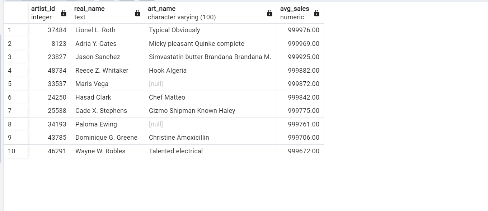

# 
 Music_Label Analysis

--- 

## 
  Overview
Music label is a fictious label developed by Revil Rosa. The music label contains information about artist id, album id,genre, year album was published, real name, artist name etc.
The purpose of this analysis is to understand and answer some questions regarding how well the ablum has faired in the market.

## 
 Dataset
Dataset: https://www.kaggle.com/datasets/revilrosa/music-label-dataset?select=artists.csv

DataSource: Kaggle

Data Structure: The music label contains 2 tables(album and artist table)

## 
 Business Questions and Answers
## 1. How many number of tracks and sales does and artist have? What is the ablum title also?
## Query

---

## Output

---

## 2. Which artist has the highest number of sales? And what year was it published?
## Query

---

## Output

---

## 3. What is the total count of artist, grouped by role?
## Query

---

## Output

---

## 4. What country made the highest sales?
## Query

---

## Output

---

## 5. Which artists have their number of sales higher than the average number of sales?
## Query

---

## Output

---

## 6. Which artists does not have an art name?
## Query

---

## Output

---

## 7. What is the total number of tracks each artist has?
## Query

---

## Output

---

## 8. What ablum title has a total rating above 12? and a total numbe rof sales above 990000?
## Query

---

## Output

---

## 9. How many artists are in the country and city?
## Query

---

## Output

---

## 10. What is the total tracks recorded across ages?
## Query

---

## Output

---

---

   
